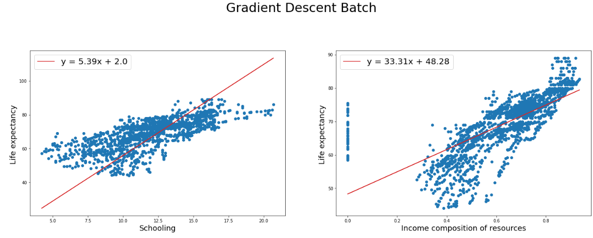
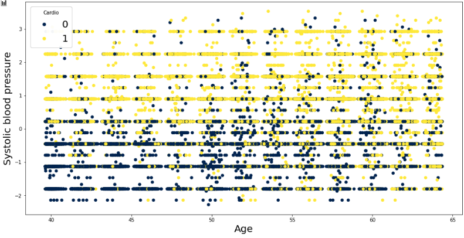
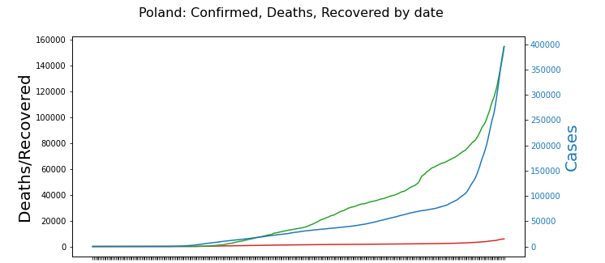

[tags]: <> (Python, AI, Machine Learning, Pandas, Numpy, NEAT, Django)
# Data-Science
Data Science and Machine learning semi-projects
---
* Linear Regression
  ---
  [This notebook](https://github.com/Raff-dev/Data-Science/blob/main/MachineLearning/linear_regression.ipynb)
  showcases the differences between different types (Batch, Mini-batch, Stochastic) of the gradient descent and their implementations, and tries to predict life expectancy based on various input variables.
  
  #### Sample results:
  <p align="center">
  
  </p>
  
  #### Algorithm implementation:
  ```python
  def gradient_descent_mini_batch(x , y, epochs, batch_size = 64, learning_rate = 10**-6):
    variables = x.shape[0]
    observations = x.shape[1]
    theta = np.ones([variables, 1])
    costs = []
    for _ in range(epochs):
        for sx, sy in zip(sample(x, size=batch_size), sample(y, size=batch_size)):
            diff = theta.T.dot(sx) - sy
            grad = sx.dot(diff.T)
            theta -= batch_size * learning_rate * grad

            cost = (diff**2).sum() / batch_size
            costs.append(cost)
    return theta, costs
   ```
  
  ### [Dataset link](https://www.kaggle.com/sulianova/cardiovascular-disease-dataset)   
  
  
* Logistic  Regression
  ---
  [This notebook](https://github.com/Raff-dev/Data-Science/blob/main/MachineLearning/logistic_regression.ipynb)
  covers the topic of prediction of Cardiovascular diseases using logistic regression mini-batch, obtaining just about 80% accuracy.
  
  #### Analyzed Data:
  <p align="center">
  
  </p>
  
  #### Algorithm implementation:
  ```python
  def logistic_regression_mini_batch(X, Y, epochs, batch_size, learning_rate):
    n_features = X.shape[0]
    n_data = X.shape[1]

    theta = np.ones([n_features, 1])
    costs = []
    accuracies = []

    for _ in range(epochs):
        for sX, sY in iterate(X, Y, size=batch_size):
            sY_pred = predict(theta, sX)
            grad = 1 / batch_size * sX.dot((sY_pred - sY).T)
            theta -= learning_rate * grad

            _cost = cost(sY_pred, sY)
            costs.append(_cost)

            _accuracy = accuracy(classify(sY_pred), sY)
            accuracies.append(_accuracy)

    Y_pred = predict(theta,X)
    result = classify(Y_pred)
    _accuracy = accuracy(result,Y)
    return {'theta':theta, 'result':result, 'costs':costs, 'accuracy':_accuracy}
    ```
    
  #### Features and size of data used:
  ```
  X features: ['ap_hi', 'cholesterol']
  Y feature: cardio
  Training data size: 17614 - 70.0%
  Test data size: 7549 - 30.0%
  ```

  #### Results:
  ```
  Execution time 2.40
  Model parameters:
    Epochs: 40
    Batch size: 256
    Learning rate: 3.70E-02

  Model output:
    Equation: y = -0.51 + 1.26*ap_hi + 0.34*cholesterol
    Training accuracy: 77.04%
    Test accuracy: 78.28%
  ```
  ### [Dataset link](https://www.kaggle.com/kumarajarshi/life-expectancy-who)   
  

* Flappy-Bird
  ---
  Flappy bird created using pygame python game engine.
  Controlled by an artificial inteligence trained using NeuroEvolution of Augmenting Topologies genetic algorithm.
  <p align="center">
  
  </p>


Covid Analysis
---
* 'KoronaScience' Python and data science course.
  ---
  <p align="center">
  
  </p>
  
  #### Notebooks:
  * [Ex 1](https://github.com/Raff-dev/Data-Science/blob/main/CovidAnalysis/Korona%20Science/hw1.ipynb)
  * [Ex 1](https://github.com/Raff-dev/Data-Science/blob/main/CovidAnalysis/Korona%20Science/hw2.ipynb)
  * [Project](https://github.com/Raff-dev/Data-Science/blob/main/CovidAnalysis/Korona%20Science/KoronaScience4.ipynb)
  
  ### [Dataset link](https://raw.githubusercontent.com/CSSEGISandData/COVID-19/master/csse_covid_19_data)   

* Functional Programming university class
  ---
  Comparison of countries in terms of Covid cases using Python's Pandas and Numpy libraries, 
  extended by a Django Rest Framework Api acting as a database and organization system.   
  Covers serialization and uploading csv data to the Api.
